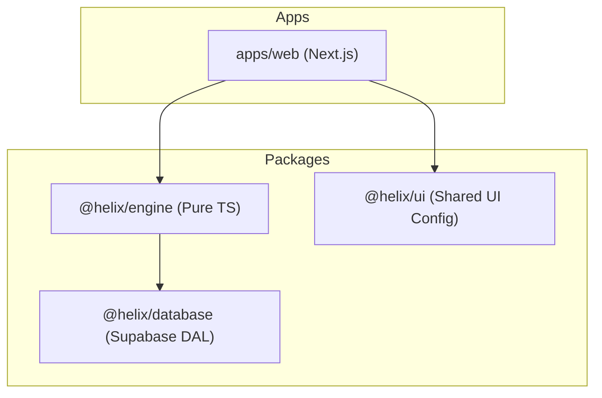

# HeliX — The AI Gym Operating System

HeliX is a high-performance, mobile-first workout tracking platform built to evolve into a full-scale **AI Gym Copilot**. 

This repository is a **Turborepo-powered monorepo** housing the entire HeliX ecosystem, from core business logic to the web frontend.

---

## 🏗️ Monorepo Architecture

HeliX follows a **Strict 4-Layer Architecture** to ensure that the "brain" (business logic) is 100% decoupled from the UI.



- **`apps/web`**: The flagship web application built with Next.js, TailwindCSS, and shadcn/ui.
- **`packages/engine`**: The platform-agnostic Core Decision Engine. Handles PR detection, scoring, and workout rules.
- **`packages/database`**: Data Access Layer (DAL). Maps engine interfaces to Supabase/PostgreSQL.
- **`packages/ui`**: Shared design system tokens and component configurations.

---

## 🚀 Vision: AI Gym Copilot

HeliX moves beyond simple logging. By leveraging structured performance data, it builds a foundation for real-time coaching, fatigue modeling, and adaptive programming.


---

## 🛠️ Getting Started

### Prerequisites
- [pnpm](https://pnpm.io/) (Recommended) or `npm`
- Node.js 18+

### Installation
```bash
pnpm install
```

### Development
Start all applications and packages in development mode:
```bash
pnpm dev
```

### Build
```bash
pnpm build
```

---

## 📖 Documentation

Detailed documentation is available in the `docs/` directory:

- [**V1 Project Documentation**](docs/v1_documentation.md) — Full technical overview and current status.
- [**System Design**](docs/system_design.md) — 4-layer architectural philosophy.
- [**Multi-Agent AI Architecture**](docs/multi_agent_architecture.md) — Blueprint for the Phase 4 AI Copilot.

---

## 🗺️ Roadmap

1.  **Phase 1 (Current)**: Core Workout Tracker + Monorepo Scaffolding.
2.  **Phase 2**: Advanced Training Analytics & Muscular Fatigue Modeling.
3.  **Phase 3**: AI-Assisted Programming & Smart Load Prediction.
4.  **Phase 4**: Full Multi-Agent AI Gym Copilot.

---
*Built with precision for the modern athlete.*
