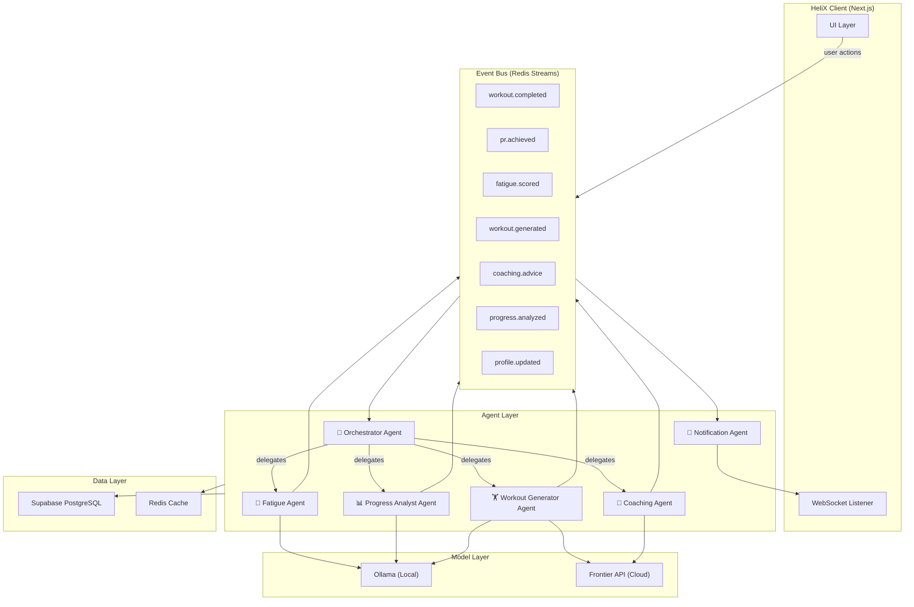
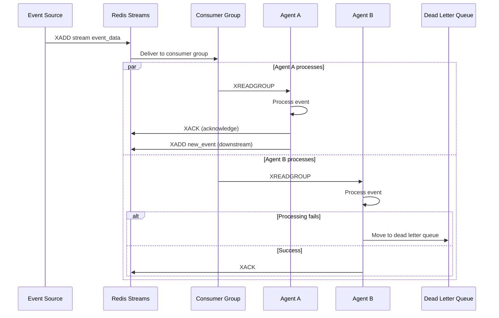
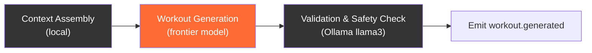
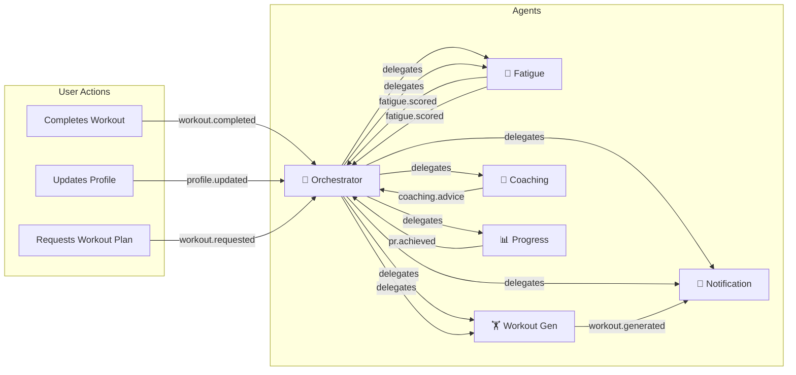
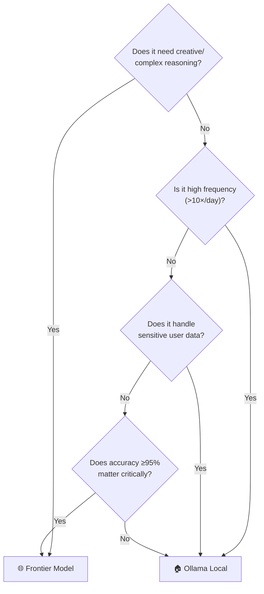
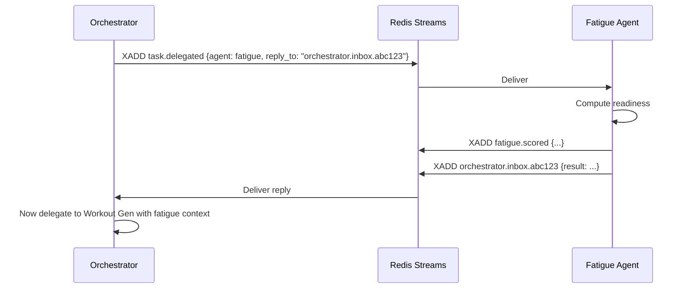
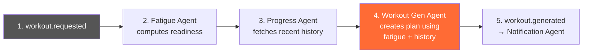
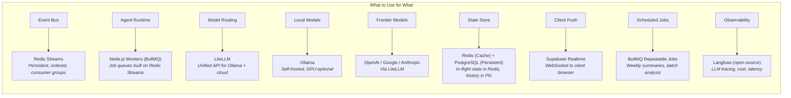
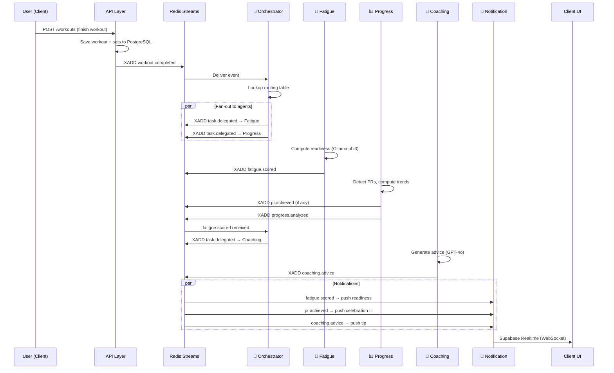
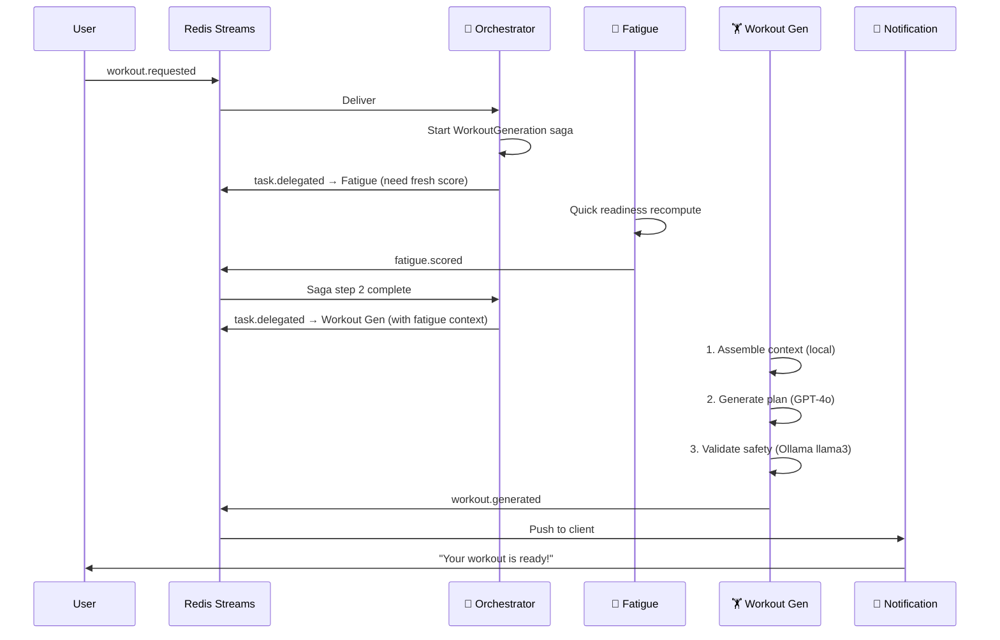

# HeliX — Multi-Agent AI Architecture

A detailed architecture for the autonomous, event-driven multi-agent AI system powering HeliX's intelligent training features.

---

## Table of Contents

1. [Design Philosophy](#1-design-philosophy)
2. [System Overview](#2-system-overview)
3. [Event-Driven Backbone](#3-event-driven-backbone)
4. [Agent Catalog](#4-agent-catalog)
5. [Model Strategy: Ollama × Frontier](#5-model-strategy-ollama--frontier)
6. [Agent Communication Patterns](#6-agent-communication-patterns)
7. [Event Schema & Contract](#7-event-schema--contract)
8. [Infrastructure & Technology Choices](#8-infrastructure--technology-choices)
9. [Data Flow: End-to-End Scenarios](#9-data-flow-end-to-end-scenarios)
10. [Observability & Guardrails](#10-observability--guardrails)
11. [Best Practices](#11-best-practices)

---

## 1. Design Philosophy

HeliX's AI layer follows three governing principles:

| Principle | What It Means |
|-----------|--------------|
| **Event-first** | Nothing calls anything directly. Every state change emits an event, and agents react to the events they care about. This makes the system inherently decoupled and extensible. |
| **Autonomy by default** | Each agent owns its domain completely. The orchestrator delegates, not micromanages. Agents decide *how* to accomplish their task. |
| **Local where possible, frontier where necessary** | Sensitive data and high-frequency tasks run on local Ollama models. Complex reasoning and generation tasks call frontier models. The routing is explicit and configurable per agent. |

---

## 2. System Overview



---

## 3. Event-Driven Backbone

### Why Event-Driven?

The user's request is clear: **"stuff at one place should influence the other."** An event-driven architecture achieves this naturally:

- User finishes a workout → `workout.completed` event fires
- Fatigue Agent hears it → recomputes readiness → emits `fatigue.scored`
- Coaching Agent hears `fatigue.scored` → adjusts tomorrow's advice → emits `coaching.advice`
- Notification Agent hears `coaching.advice` → pushes update to client

No agent calls another. They all react independently to events they subscribe to.

### Event Bus: Redis Streams

> [!IMPORTANT]
> **Why Redis Streams over Kafka?**
> Kafka is overkill for HeliX's scale. Redis Streams provides ordered, persistent, consumer-group-based event streaming with far less operational complexity. It also doubles as a cache layer for agent state.

| Feature | Redis Streams | Kafka | Supabase Realtime |
|---------|--------------|-------|-------------------|
| Persistence | ✅ Yes | ✅ Yes | ❌ Ephemeral |
| Consumer groups | ✅ Yes | ✅ Yes | ❌ No |
| Operational complexity | Low | High | None |
| Cost at HeliX scale | ~$0/mo (self-hosted) | Overkill | Free tier |
| Replay / reprocessing | ✅ Yes | ✅ Yes | ❌ No |
| Best for | **This project** | Enterprise scale | UI notifications only |

**Supabase Realtime** is still used, but only for the **last mile** — pushing processed results from the server to the client's UI over WebSockets.

### Core Event Lifecycle



---

## 4. Agent Catalog

### 4.1 🎯 Orchestrator Agent

The brain of the system. It doesn't do domain work — it **routes, prioritizes, and coordinates**.

| Property | Value |
|----------|-------|
| **Subscribes to** | All events |
| **Emits** | `task.delegated`, `task.failed`, `system.health` |
| **Model** | Ollama `mistral` (fast routing decisions) |
| **Stateful?** | Yes — tracks in-flight tasks in Redis |

**Responsibilities:**
- Receives high-level triggers (e.g., `workout.completed`) and decides which agents need to act
- Manages execution order when agents have dependencies (e.g., fatigue score must exist before workout generation)
- Implements circuit breakers — if an agent fails 3× in a row, it stops delegating and emits `task.failed`
- Handles **fan-out**: one event may trigger multiple agents in parallel

```typescript
// Orchestrator routing logic (pseudocode)
const ROUTING_TABLE: Record<string, string[]> = {
  'workout.completed': ['fatigue-agent', 'progress-agent', 'notification-agent'],
  'fatigue.scored':    ['coaching-agent', 'notification-agent'],
  'profile.updated':   ['workout-generator-agent'],
  'pr.achieved':       ['notification-agent', 'coaching-agent'],
};
```

---

### 4.2 🔋 Fatigue Agent

Computes a **readiness score** (0–100) based on recent training history.

| Property | Value |
|----------|-------|
| **Subscribes to** | `workout.completed`, `profile.updated` |
| **Emits** | `fatigue.scored` |
| **Model** | Ollama `phi3` or custom fine-tuned model |
| **Why local?** | Runs on every workout completion — high frequency, simple math + light LLM reasoning. Sensitive biometric data stays local. |

**Inputs:**
- Last 7 days of workout volume (sets × reps × weight)
- RPE values from recent sets
- Sleep/recovery data (future: wearable integration)
- Body weight trend

**Output:**
```json
{
  "readiness_score": 72,
  "muscle_group_fatigue": {
    "chest": 0.85,
    "legs": 0.30,
    "back": 0.55
  },
  "recommendation": "Upper body is heavily fatigued. Prioritize legs or active recovery.",
  "confidence": 0.88
}
```

---

### 4.3 🏋️ Workout Generator Agent

Creates complete, personalized workout plans.

| Property | Value |
|----------|-------|
| **Subscribes to** | `task.delegated` (from orchestrator), `profile.updated` |
| **Emits** | `workout.generated` |
| **Model** | **Frontier** (GPT-4o / Gemini Pro) for generation, **Ollama** `llama3` for validation |
| **Why frontier?** | Workout programming requires deep domain knowledge, periodization logic, and creative exercise selection that small models do poorly. |

**Two-stage pipeline:**



1. **Context Assembly** (local, no LLM): Pulls user profile, fatigue scores, recent workout history, PRs, and preferences from DB/cache
2. **Generation** (frontier): Sends structured prompt with full context to GPT-4o/Gemini. Gets a complete workout plan
3. **Validation** (Ollama): Local model checks for safety (no heavy squats day after max squat session), progressive overload adherence, and exercise availability

> [!CAUTION]
> **Never send raw user PII to frontier models.** The context assembly step must strip emails, names, and identifiable info. Send only training metrics and anonymized profile data.

---

### 4.4 🧠 Coaching Agent

Provides natural-language training advice and long-term strategy.

| Property | Value |
|----------|-------|
| **Subscribes to** | `fatigue.scored`, `pr.achieved`, `progress.analyzed` |
| **Emits** | `coaching.advice` |
| **Model** | **Frontier** (GPT-4o / Claude) for advice, **Ollama** for summarization |
| **Why frontier?** | Coaching requires nuanced reasoning: interpreting trends, motivating the user, and making periodization recommendations. |

**Capabilities:**
- Weekly training summaries with actionable feedback
- Deload week recommendations when fatigue accumulates
- Plateau detection and suggested changes
- PR celebration messages with context ("This is your first bench PR in 6 weeks!")
- Long-term programming suggestions (bulk/cut cycles, strength blocks)

---

### 4.5 📊 Progress Analyst Agent

Crunches numbers and detects patterns.

| Property | Value |
|----------|-------|
| **Subscribes to** | `workout.completed` |
| **Emits** | `progress.analyzed`, `pr.achieved` |
| **Model** | **Ollama** `phi3` for trend narration. Mostly algorithmic — minimal LLM needed. |
| **Why local?** | This is primarily computation (aggregations, trend detection, PR comparisons). The LLM only narrates the findings. |

**Computed Metrics:**
- Volume per muscle group (weekly rolling)
- Strength progression curves
- PR detection (1RM, volume PRs, rep PRs)
- Training frequency and consistency scores
- Plateau detection (≥3 weeks with <2% strength change)

---

### 4.6 🔔 Notification Agent

The user-facing output channel. Translates agent events into UI updates.

| Property | Value |
|----------|-------|
| **Subscribes to** | `coaching.advice`, `pr.achieved`, `fatigue.scored`, `workout.generated` |
| **Emits** | Pushes to client via **Supabase Realtime** WebSocket |
| **Model** | None — pure event routing |

**Delivery channels:**
- In-app toast notifications (sonner)
- Dashboard card updates (readiness score, coaching tips)
- Push notifications (future: via Firebase Cloud Messaging)

---

### Agent Interaction Map



---

## 5. Model Strategy: Ollama × Frontier

### Decision Framework

Use this matrix to decide which model tier to use for any task:



### Model Assignment Table

| Agent | Task | Model Tier | Recommended Model | Why |
|-------|------|-----------|-------------------|-----|
| Orchestrator | Task routing | 🏠 Ollama | `mistral` (7B) | Fast, simple classification. No complex reasoning. |
| Fatigue | Readiness scoring | 🏠 Ollama | `phi3` (3.8B) | Mostly math + light reasoning. Privacy-sensitive. High frequency. |
| Fatigue | Fatigue narration | 🏠 Ollama | `phi3` | Turning scores into short readable text. |
| Workout Gen | Context assembly | ⚙️ None | Algorithmic | No LLM needed — just DB queries. |
| Workout Gen | Plan generation | 🌐 Frontier | `gpt-4o` / `gemini-pro` | Complex domain reasoning, periodization, creative programming. |
| Workout Gen | Safety validation | 🏠 Ollama | `llama3` (8B) | Binary safety checks against rules. |
| Coaching | Training advice | 🌐 Frontier | `gpt-4o` / `claude-sonnet` | Nuanced, motivational, context-heavy writing. |
| Coaching | Summarization | 🏠 Ollama | `llama3` (8B) | Summarizing weekly stats for the prompt context. |
| Progress | Trend detection | ⚙️ None | Algorithmic | Pure math — moving averages, comparisons. |
| Progress | Insight narration | 🏠 Ollama | `phi3` | Turning data points into 1–2 sentence insights. |

### Model Router: LiteLLM

Use **LiteLLM** as the unified interface for all model calls. It provides:

- **Single API** that works with Ollama, OpenAI, Anthropic, Google, and 100+ providers
- **Fallback chains**: if the local model fails, automatically retry with frontier
- **Cost tracking**: per-call cost logging for frontier models
- **Rate limiting**: built-in rate limits per model

```typescript
// lib/ai/model-router.ts

import { litellm } from 'litellm';

export type ModelTier = 'local' | 'frontier';

interface ModelConfig {
  local: string;    // Ollama model name
  frontier: string; // Cloud model identifier
}

const MODEL_CONFIGS: Record<string, ModelConfig> = {
  'orchestrator':       { local: 'ollama/mistral',  frontier: 'gpt-4o-mini' },
  'fatigue':            { local: 'ollama/phi3',     frontier: 'gpt-4o-mini' },
  'workout-generation': { local: 'ollama/llama3',   frontier: 'gpt-4o' },
  'coaching':           { local: 'ollama/llama3',   frontier: 'gpt-4o' },
  'progress-narration': { local: 'ollama/phi3',     frontier: 'gpt-4o-mini' },
};

export async function callModel(
  agent: string,
  tier: ModelTier,
  messages: Message[],
  options?: { fallback?: boolean }
) {
  const config = MODEL_CONFIGS[agent];
  const model = tier === 'local' ? config.local : config.frontier;

  try {
    return await litellm.completion({ model, messages });
  } catch (error) {
    if (options?.fallback && tier === 'local') {
      // Fallback to frontier if local fails
      console.warn(`[${agent}] Local model failed, falling back to frontier`);
      return await litellm.completion({ model: config.frontier, messages });
    }
    throw error;
  }
}
```

> [!TIP]
> **Ollama must be running on the deployment server** (or a sidecar container). For development, it runs on `localhost:11434`. For production, consider a dedicated GPU instance or a Kubernetes pod with GPU access.

---

## 6. Agent Communication Patterns

### Pattern 1: Fire-and-Forget (Most Events)

The default. An agent emits an event and moves on. No response expected.

```
[Fatigue Agent] --fatigue.scored--> [Redis Streams] ---> [Coaching Agent]
                                                     \-> [Notification Agent]
```

### Pattern 2: Request-Reply (Orchestrator ↔ Agent)

When the orchestrator needs a result to decide the next step (e.g., fatigue score before generating a workout):



### Pattern 3: Saga (Multi-Step Workout Generation)

When a workflow spans multiple agents with ordering constraints:



The orchestrator manages this saga by tracking state:

```typescript
// Saga state in Redis
interface WorkoutGenerationSaga {
  id: string;
  status: 'pending_fatigue' | 'pending_progress' | 'generating' | 'complete' | 'failed';
  fatigue_score?: number;
  recent_history?: WorkoutSummary[];
  generated_workout?: Workout;
  started_at: number;
  timeout_ms: 30000;
}
```

---

## 7. Event Schema & Contract

> [!IMPORTANT]
> **Every event must follow a strict schema.** Without this, agent interop breaks silently.

### Base Event Envelope

```typescript
interface HelixEvent<T = unknown> {
  // Metadata
  id: string;                    // UUID v4
  type: string;                  // e.g., "workout.completed"
  version: string;               // e.g., "1.0.0" (semver)
  timestamp: string;             // ISO 8601
  source: string;                // Agent that emitted it
  correlation_id: string;        // Links related events in a flow
  
  // Payload
  data: T;
  
  // Optional
  user_id?: string;              // Which user this relates to
  reply_to?: string;             // For request-reply pattern
}
```

### Domain Events

| Event | Payload | Emitted By | Consumed By |
|-------|---------|-----------|-------------|
| `workout.completed` | `{ workout_id, user_id, exercises, duration, total_volume }` | Client | Orchestrator |
| `fatigue.scored` | `{ user_id, readiness_score, muscle_fatigue_map, recommendation }` | Fatigue Agent | Orchestrator, Coaching, Notification |
| `workout.generated` | `{ user_id, workout_plan, target_muscle_groups, estimated_duration }` | Workout Gen | Notification |
| `coaching.advice` | `{ user_id, advice_type, message, priority }` | Coaching Agent | Notification |
| `pr.achieved` | `{ user_id, exercise_id, weight, previous_pr, pr_type }` | Progress Agent | Coaching, Notification |
| `progress.analyzed` | `{ user_id, period, trends, plateaus, volume_data }` | Progress Agent | Coaching |
| `profile.updated` | `{ user_id, changed_fields }` | Client | Orchestrator |
| `task.delegated` | `{ target_agent, task_type, context, reply_to? }` | Orchestrator | Target Agent |
| `task.failed` | `{ agent, error, event_id, retry_count }` | Any Agent | Orchestrator |

---

## 8. Infrastructure & Technology Choices

### Stack Summary



### Technology Deep-Dives

#### Redis Streams + BullMQ

**BullMQ** is a Node.js job queue built on top of Redis Streams. It provides:
- ✅ Persistent, ordered job queues
- ✅ Consumer groups (multiple workers per agent)
- ✅ Retries with exponential backoff
- ✅ Dead letter queues
- ✅ Job prioritization
- ✅ Rate limiting per queue
- ✅ Cron/repeatable jobs (weekly coaching summaries)
- ✅ Dashboard UI (Bull Board) for monitoring

```typescript
// agents/fatigue/worker.ts  (example agent worker)
import { Worker, Queue } from 'bullmq';

const fatigueQueue = new Queue('fatigue-agent', { connection: redis });

const worker = new Worker('fatigue-agent', async (job) => {
  const { user_id, workout_id } = job.data;

  // 1. Fetch recent training data
  const history = await fetchRecentWorkouts(user_id, 7);

  // 2. Compute fatigue scores algorithmically
  const muscleFatigue = computeMuscleFatigue(history);

  // 3. Get narration from local model
  const narration = await callModel('fatigue', 'local', [
    { role: 'system', content: FATIGUE_SYSTEM_PROMPT },
    { role: 'user', content: JSON.stringify(muscleFatigue) }
  ]);

  // 4. Emit downstream event
  await emitEvent('fatigue.scored', {
    user_id,
    readiness_score: muscleFatigue.overall,
    muscle_fatigue_map: muscleFatigue.perGroup,
    recommendation: narration,
  });
}, { connection: redis, concurrency: 5 });
```

#### Ollama Setup

```bash
# Install Ollama
curl -fsSL https://ollama.com/install.sh | sh

# Pull required models
ollama pull mistral      # Orchestrator routing (7B, ~4GB)
ollama pull phi3         # Fatigue/Progress narration (3.8B, ~2.3GB)
ollama pull llama3       # Workout validation, coaching summarization (8B, ~4.7GB)
```

**Hardware requirements for local inference:**
| Model | VRAM (GPU) | RAM (CPU fallback) | Tokens/sec (GPU) | Tokens/sec (CPU) |
|-------|-----------|-------------------|-------------------|-------------------|
| `phi3` (3.8B) | 3 GB | 6 GB | ~80 t/s | ~15 t/s |
| `mistral` (7B) | 5 GB | 8 GB | ~50 t/s | ~8 t/s |
| `llama3` (8B) | 6 GB | 10 GB | ~45 t/s | ~6 t/s |

> [!TIP]
> For a dev machine with 16 GB RAM and no GPU, CPU inference with `phi3` is fast enough for development. For production, a single NVIDIA T4 (16 GB VRAM) can run all three models simultaneously.

---

## 9. Data Flow: End-to-End Scenarios

### Scenario: User Finishes a Workout

This is the most important flow — it triggers the entire agent cascade.



### Scenario: User Requests a New Workout Plan



---

## 10. Observability & Guardrails

### LLM Observability with Langfuse

**Langfuse** (open-source, self-hostable) provides:
- 📊 Per-call latency, cost, and token usage
- 🔍 Full prompt/response tracing
- 📈 Quality scoring per agent
- 🚨 Alerting on cost spikes or error rates

```typescript
// lib/ai/tracing.ts
import { Langfuse } from 'langfuse';

const langfuse = new Langfuse({
  publicKey: process.env.LANGFUSE_PUBLIC_KEY,
  secretKey: process.env.LANGFUSE_SECRET_KEY,
});

export function traceAgentCall(agent: string, model: string) {
  return langfuse.trace({
    name: `${agent}:${model}`,
    metadata: { agent, model, tier: model.startsWith('ollama') ? 'local' : 'frontier' },
  });
}
```

### Guardrails

| Guardrail | Implementation |
|-----------|---------------|
| **Cost cap** | LiteLLM budget alerts. Hard kill switch at $X/month. |
| **Timeout** | Every agent task has a 30s timeout. Orchestrator saga has a 60s global timeout. |
| **Retry policy** | 3 retries with exponential backoff (1s, 4s, 16s). Then dead letter queue. |
| **Content safety** | Coaching and workout generation output passes through a local Ollama safety classifier before reaching the user. |
| **PII stripping** | Context assembly step strips emails, names, and identifiers before sending to frontier models. |
| **Idempotency** | Every event has a unique `id`. Agents track processed IDs in Redis to prevent duplicate processing. |
| **Circuit breaker** | If an agent fails 5× in 10 minutes, the orchestrator stops routing to it and emits `system.degraded`. |

---

## 11. Best Practices

### Agent Design

1. **Single Responsibility** — Each agent owns exactly one domain. The Fatigue Agent doesn't generate workouts. The Coaching Agent doesn't compute PRs.

2. **Stateless Processing, Stateful Context** — Agents themselves are stateless workers. All state lives in Redis (in-flight) or PostgreSQL (persistent). This means you can scale agents horizontally by adding more BullMQ workers.

3. **Always Emit, Never Call** — Agents publish events; they never directly invoke another agent. This prevents cascading failures and makes the system testable.

4. **Schema-First Development** — Define the event schema *before* writing the agent. Use Zod to validate event payloads at both emit and consume boundaries.

```typescript
// events/schemas.ts
import { z } from 'zod';

export const FatigueScoredPayload = z.object({
  user_id: z.string().uuid(),
  readiness_score: z.number().min(0).max(100),
  muscle_fatigue_map: z.record(z.string(), z.number().min(0).max(1)),
  recommendation: z.string().max(500),
  confidence: z.number().min(0).max(1),
});
```

5. **Graceful Degradation** — If the AI layer is entirely down, the app must still work as a manual workout tracker. AI features are enhancements, not dependencies.

### Model Usage

6. **Prompt Versioning** — Store prompts in a `prompts/` directory with version numbers. Track which prompt version produced which output in Langfuse. Never hotfix prompts without incrementing the version.

```
prompts/
├── fatigue-agent/
│   ├── v1.0.md
│   └── v1.1.md
├── workout-generator/
│   ├── system-v1.0.md
│   └── system-v2.0.md
└── coaching-agent/
    └── weekly-summary-v1.0.md
```

7. **Structured Output** — Always request JSON output from models using function calling or JSON mode. Never parse free-text LLM output with regex.

8. **Local-First Testing** — Run all agents against Ollama during development and CI. Frontier models are only used in staging/production. This keeps dev costs at $0.

### Event System

9. **Event Versioning** — Use semver for event schemas. Consumers must handle unknown fields gracefully (forward compatibility). Breaking changes require a new event type.

10. **Correlation IDs** — Every event in a flow shares a `correlation_id`. This lets you trace the full journey from "user tapped Finish Workout" to "coaching advice appeared on screen" in logs.

11. **Dead Letter Queues** — Failed events go to a DLQ, not the void. Build a simple admin UI (or use Bull Board) to inspect and replay failed events.

12. **Backpressure** — If the Workout Generator is slow (frontier API latency), the orchestrator should queue requests, not drop them. BullMQ handles this natively.

### Security

13. **PII Firewall** — Build a `sanitizeForFrontier()` utility that strips PII from any context before it's sent to cloud models. Unit test it aggressively.

14. **Secret Rotation** — API keys for frontier models should be rotated monthly. Use environment variables, never hardcode.

15. **Rate Limiting** — Limit AI feature usage per user (e.g., 5 workout generations/day) to prevent abuse and cost blowout.

---

## Appendix: Recommended Folder Structure

```
helix-server/                     # Separate repo or monorepo package
├── agents/
│   ├── orchestrator/
│   │   ├── worker.ts             # BullMQ worker
│   │   ├── routing-table.ts      # Event → agent mapping
│   │   └── saga.ts               # Multi-step saga logic
│   ├── fatigue/
│   │   ├── worker.ts
│   │   ├── compute.ts            # Algorithmic fatigue computation
│   │   └── prompts/
│   │       └── narration-v1.0.md
│   ├── workout-generator/
│   │   ├── worker.ts
│   │   ├── context-assembler.ts  # Gathers data for prompt
│   │   ├── validator.ts          # Safety checks via Ollama
│   │   └── prompts/
│   │       └── generation-v1.0.md
│   ├── coaching/
│   │   ├── worker.ts
│   │   └── prompts/
│   │       ├── advice-v1.0.md
│   │       └── weekly-summary-v1.0.md
│   ├── progress/
│   │   ├── worker.ts
│   │   ├── trend-detection.ts    # Algorithmic
│   │   └── pr-detector.ts        # Algorithmic
│   └── notification/
│       └── worker.ts             # Routes to Supabase Realtime
│
├── events/
│   ├── bus.ts                    # Redis Streams wrapper
│   ├── schemas.ts                # Zod schemas for all events
│   └── types.ts                  # TypeScript event interfaces
│
├── lib/
│   ├── ai/
│   │   ├── model-router.ts       # LiteLLM wrapper
│   │   ├── tracing.ts            # Langfuse integration
│   │   └── sanitizer.ts          # PII stripping
│   ├── db/
│   │   └── queries.ts            # Supabase data access
│   └── redis/
│       └── client.ts
│
├── config/
│   ├── models.ts                 # Model configs per agent
│   └── queues.ts                 # BullMQ queue configs
│
└── docker-compose.yml            # Redis + Ollama + workers
```
