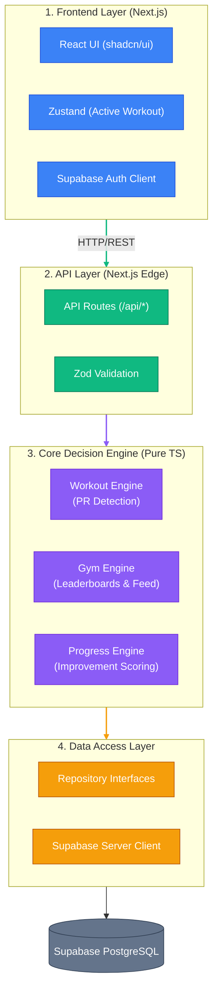
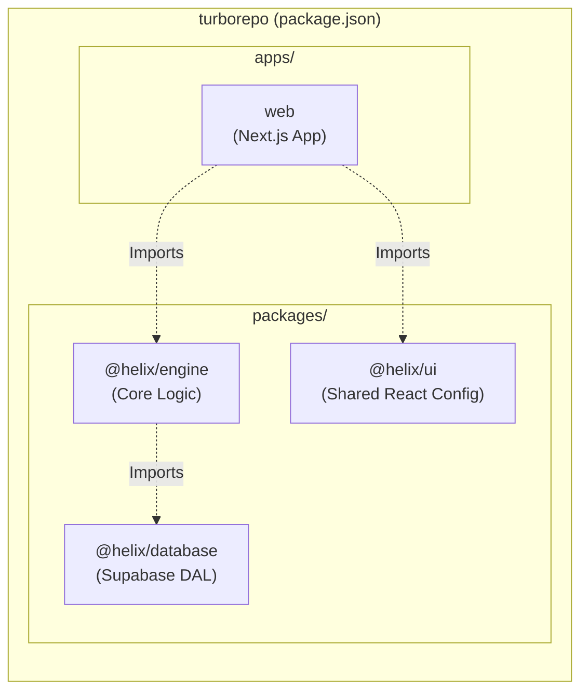
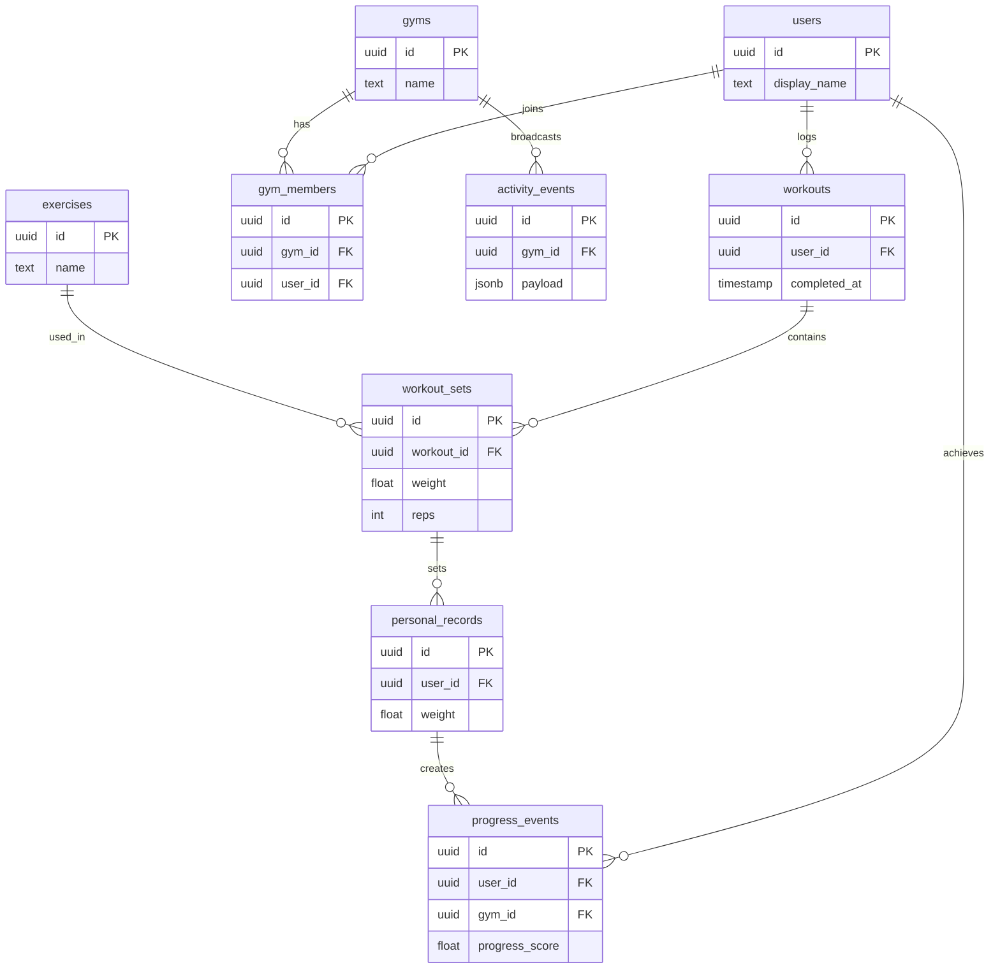
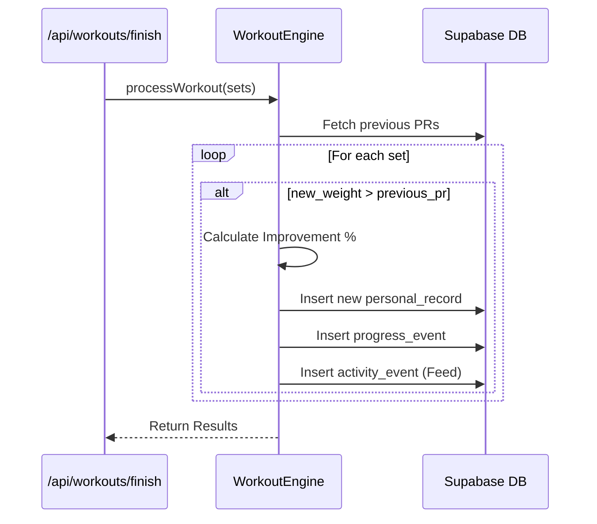

# HeliX — System Design & Architecture (MVP)

A comprehensive system design for **HeliX**, focusing on the **Minimum Viable Product (MVP)**: a mobile-first workout tracker with a local gym ecosystem.

> **MVP Scope:** Workout logging, progress tracking, and gym network leaderboards/feeds. 
> *Future AI Copilot features are deferred, but the architecture is designed to support them without rewrites.*

---

## 1. Architectural Philosophy

HeliX is built on a **Strict 4-Layer Architecture** housed within a **Turborepo Monorepo**. 

This guarantees that the "brain" of the app (the Core Decision Engine) is 100% decoupled from the UI, allowing us to easily build a React Native mobile app or attach AI agents later.

### MVP System Landscape



**The Golden Rule:** The Frontend *never* talks to the database. It only calls `/api/*`. The API *never* writes business logic. It only calls the Engine.

---

## 2. Monorepo Structure (Turborepo)

To enforce this layer separation physically, HeliX is structured as a monorepo.



**Why Monorepo?**
When we build the iOS/Android app (e.g., `apps/mobile`), we simply run `import { WorkoutEngine } from '@helix/engine'` and instantly share 100% of the business logic.

---

## 3. Database Schema

The MVP requires two core domains: **Workout Tracking** and the **Gym Ecosystem**.



---

## 4. MVP Feature: The Gym Ecosystem

Instead of competing on absolute strength (which biases advanced lifters), **HeliX leaderboards are based on the rate of personal improvement.**

### Progress Detection Flow

When a user finishes a workout, the `Core Decision Engine` runs the following logic:



### The Leaderboard (Pure SQL)

Leaderboards are calculated entirely in Postgres. No heavy backend loops.

**Scoring formula:** `progress_score = (new_pr - old_pr) / old_pr`

```sql
-- Monthly Gym Leaderboard
SELECT 
    users.display_name,
    SUM(progress_events.progress_score) as total_score
FROM progress_events
JOIN users ON users.id = progress_events.user_id
WHERE gym_id = :gym_id 
  AND created_at >= date_trunc('month', now())
GROUP BY users.id
ORDER BY total_score DESC
LIMIT 50;
```

---

## 5. Architectural Improvements Included in MVP

To ensure the MVP is immediately production-ready, we incorporate the following patterns from day one.

### A. Local-First Caching for Workouts
Gym basements have terrible internet. The active workout lives in a **Zustand store** backed by `localStorage` (or IndexedDB). 
- If the user taps "Finish Workout" and the network fails, the payload is saved to an `offline_queue`.
- When the device regains connection, the frontend flushes the queue to the `/api/workouts/finish` endpoint.

### B. Event Sourcing for Activity Feed
Instead of just logging string messages to the feed, the `activity_events` table stores **immutable facts** as JSON.

```json
// Example row in activity_events
{
  "type": "PR_BROKEN",
  "user": "Rahul",
  "exercise": "Deadlift",
  "old_pr": 120,
  "new_pr": 130,
  "unit": "kg"
}
```
The Frontend parses this JSON to render the UI. If we want to change how feeds look later, or translate them into another language, we just change the UI renderer—the raw data remains pure.

### C. Edge Runtimes
The Next.js API Routes (`/api/*`) are configured to run on the **Edge Runtime**. Because the Core Decision Engine is pure TypeScript and Supabase uses standard `fetch`, our backend runs geographically close to the user with 0ms cold starts.

---

## 6. Implementation Roadmap

Because the scope is strictly MVP, the roadmap is simplified into 3 distinct milestones.

### Milestone 1: Foundation & Monorepo
1. Convert the current Next.js folder into a Turborepo.
2. Setup `packages/engine` and `packages/database`.
3. Implement Supabase Auth (Email + Password).
4. Build the 4-layer architecture for the existing Workout Logger.

### Milestone 2: Core Workout Tracking
1. Create `workouts`, `workout_sets`, and `personal_records` tables.
2. Build the `WorkoutEngine` to handle saving sets and detecting PRs.
3. Update the Frontend to use Zustand for offline-resilient active workouts.

### Milestone 3: The Gym Ecosystem
1. Create `gyms`, `gym_members`, `progress_events`, and `activity_events` tables.
2. Build the "Join Gym" UI.
3. Hook PR detection into the `progress_events` table to assign improvement scores.
4. Build the Gym Leaderboard UI powered by the SQL aggregation query.
5. Build the real-time Gym Feed UI.
