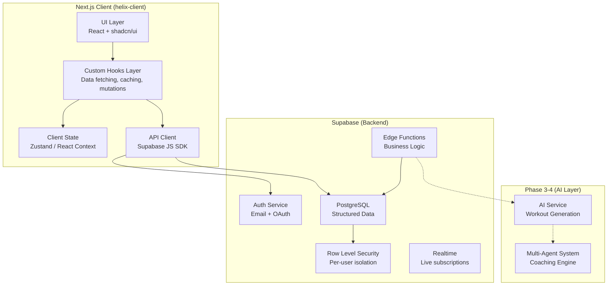
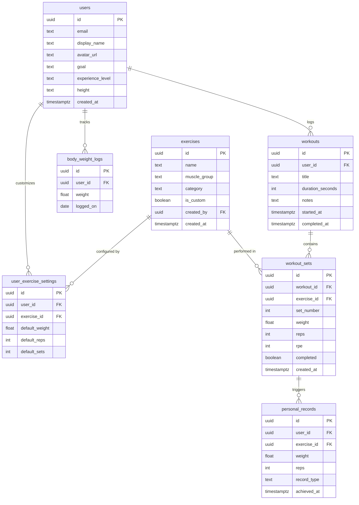
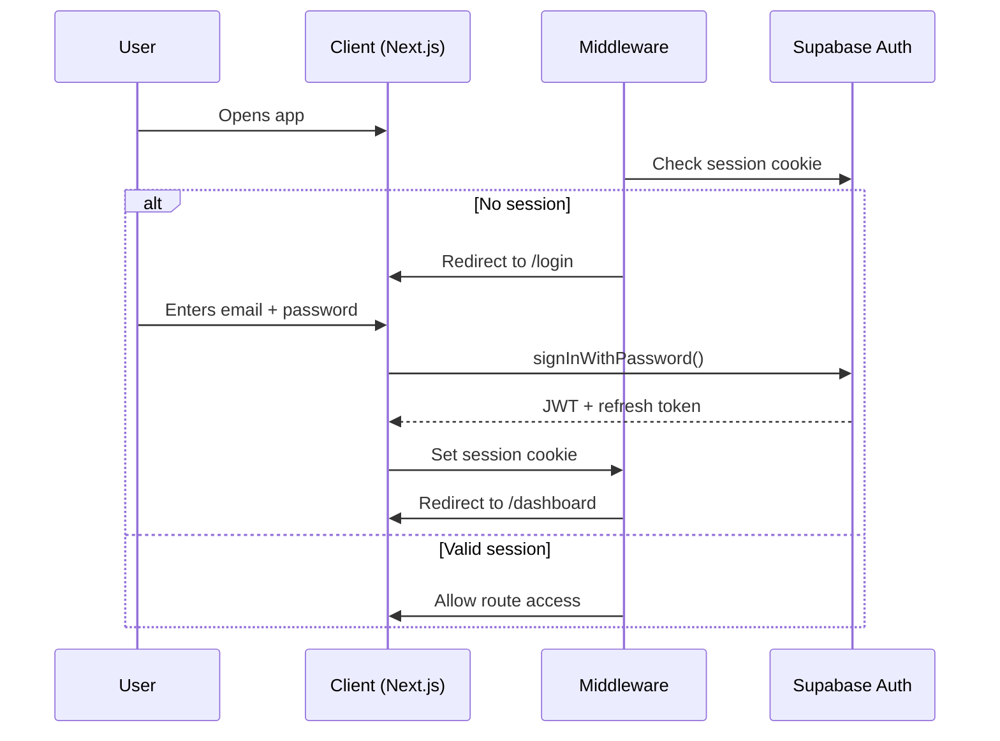
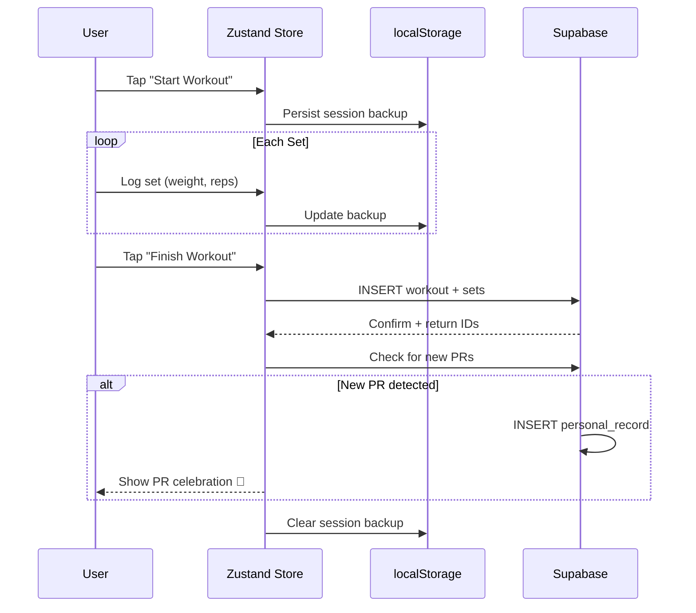
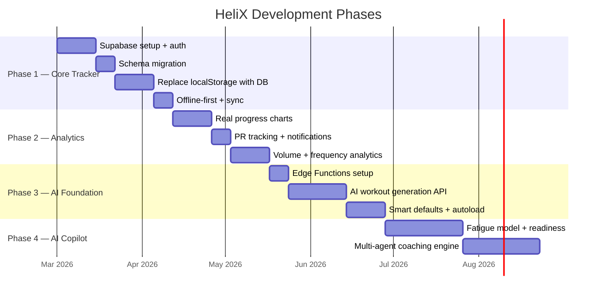
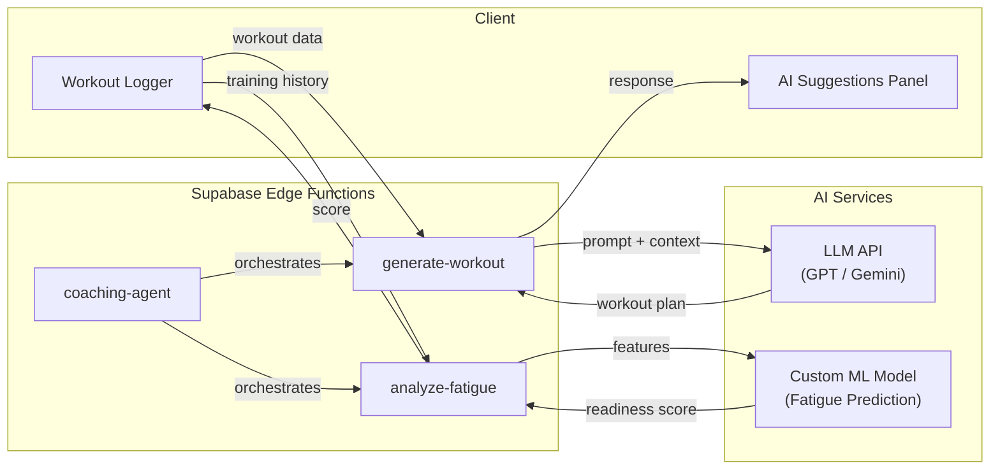

# HeliX — System Design

A comprehensive system design for **HeliX**, a mobile-first workout tracking application evolving into an AI-powered gym copilot.

---

## 1. Current State Assessment

The current codebase is a **frontend-only Next.js app** with:

| Layer | Current State | Gap |
|-------|--------------|-----|
| **Data** | `localStorage` with hardcoded mock data | No persistence, no multi-device sync |
| **Auth** | None | No user identity |
| **API** | None | No server communication |
| **State** | Per-component `useState` + `useEffect` | No shared state management |
| **Types** | Inline interfaces per component | No shared type system |

---

## 2. High-Level Architecture



---

## 3. Database Schema (Supabase PostgreSQL)

> [!IMPORTANT]
> This expands on the schema outlined in the README to support all v1 features plus a clean path to AI features in later phases.



### Key Design Decisions

- **`personal_records`** is a separate table (not a computed view) for fast dashboard queries and historical tracking.
- **`user_exercise_settings`** stores per-user defaults so the workout logger can pre-fill weight/reps from the last session.
- **`workout_sets.rpe`** (Rate of Perceived Exertion) is included early — it's critical data for the future AI fatigue model.
- **`exercises.is_custom`** + `created_by` allows users to add custom exercises while keeping a global exercise library.

---

## 4. Frontend Architecture

### Recommended Layer Structure

```
helix-client/
├── app/                          # Next.js App Router (pages)
│   ├── (auth)/                   # Auth group route
│   │   ├── login/page.tsx
│   │   └── signup/page.tsx
│   ├── (app)/                    # Authenticated app shell
│   │   ├── layout.tsx            # Bottom nav + auth guard
│   │   ├── page.tsx              # Dashboard
│   │   ├── workout/page.tsx
│   │   ├── progress/page.tsx
│   │   └── profile/page.tsx
│   └── layout.tsx                # Root layout (theme, fonts)
│
├── components/
│   ├── ui/                       # shadcn primitives (no changes)
│   ├── dashboard/
│   ├── workout/
│   ├── progress/
│   ├── profile/
│   └── layout/
│
├── lib/
│   ├── supabase/
│   │   ├── client.ts             # Browser Supabase client
│   │   ├── server.ts             # Server-side Supabase client
│   │   └── middleware.ts         # Auth session refresh
│   ├── types/
│   │   └── database.ts           # Auto-generated Supabase types
│   └── utils.ts
│
├── hooks/
│   ├── use-auth.ts               # Auth state + methods
│   ├── use-workouts.ts           # Workout CRUD + caching
│   ├── use-exercises.ts          # Exercise list + search
│   ├── use-progress.ts           # Progress data fetching
│   └── use-profile.ts            # Profile CRUD
│
├── stores/
│   └── workout-session.ts        # Zustand store for active workout
│
└── middleware.ts                  # Next.js middleware (auth redirect)
```

### State Management Strategy

| State Type | Solution | Rationale |
|-----------|----------|-----------|
| **Server state** (workouts, exercises, PRs) | React Query or SWR via Supabase hooks | Automatic caching, revalidation, optimistic updates |
| **Active workout session** | Zustand store + `localStorage` backup | Fast in-memory updates during a workout; survives page refresh |
| **Auth state** | Supabase Auth + React Context | Built-in session management |
| **UI state** (modals, tabs) | Local component `useState` | No persistence needed |

> [!TIP]
> Using a Zustand store for the **active workout session** is critical. The current `useState` + `localStorage` approach works, but a dedicated store enables undo/redo, mid-workout recovery, and eventually syncing partial workouts to the server.

---

## 5. Authentication Flow



**Supported providers (recommended):**
- Email + Password (for launch)
- Google OAuth (high-value for gym users who already have Google accounts)

---

## 6. Key Data Flows

### Workout Logging Flow



> [!NOTE]
> The `localStorage` backup ensures that if the user loses connection mid-workout or closes the app, the session can be recovered. This is one of the most important UX features for a gym app.

### Progress Data Query

```sql
-- Strength progression for a given exercise (used by ProgressTracker)
SELECT
  date_trunc('week', ws.created_at) AS week,
  MAX(ws.weight) AS max_weight,
  SUM(ws.weight * ws.reps) AS total_volume
FROM workout_sets ws
JOIN workouts w ON ws.workout_id = w.id
WHERE w.user_id = :user_id
  AND ws.exercise_id = :exercise_id
GROUP BY week
ORDER BY week;
```

This replaces the current hardcoded `mockData` in `progress-tracker.tsx`.

---

## 7. Security — Row Level Security (RLS)

Every table must have RLS policies so users can only access their own data:

```sql
-- Example: workouts table
ALTER TABLE workouts ENABLE ROW LEVEL SECURITY;

CREATE POLICY "Users can manage own workouts"
ON workouts FOR ALL
USING (auth.uid() = user_id)
WITH CHECK (auth.uid() = user_id);
```

This pattern repeats for `workout_sets`, `personal_records`, `body_weight_logs`, and `user_exercise_settings`.

The `exercises` table has a different policy: everyone can **read** global exercises, but only the creator can modify custom ones.

---

## 8. API Design (Supabase Client)

No custom REST API is needed for v1. The Supabase JS SDK provides typed, direct database access with RLS enforcement. Example patterns:

```typescript
// lib/supabase/queries.ts

// Fetch user's workouts with sets
const { data } = await supabase
  .from('workouts')
  .select(`*, workout_sets(*, exercises(*))`)
  .eq('user_id', userId)
  .order('started_at', { ascending: false })
  .limit(20);

// Log a completed workout (transaction-like)
const { data: workout } = await supabase
  .from('workouts')
  .insert({ user_id: userId, started_at, completed_at })
  .select()
  .single();

await supabase
  .from('workout_sets')
  .insert(sets.map(s => ({ ...s, workout_id: workout.id })));
```

---

## 9. Phased Roadmap with Architecture Milestones



---

## 10. Phase 3–4: AI Architecture (Future)

When the time comes, the AI layer should be built as **Supabase Edge Functions** calling external AI services, keeping the architecture clean:



> [!IMPORTANT]
> The key insight is: **all AI features depend on clean, structured training data.** Phase 1–2 is about capturing that data correctly. Do not rush to AI.

---

## 11. Non-Functional Requirements

| Concern | Target | Approach |
|---------|--------|----------|
| **Performance** | < 200ms page load on 4G | Next.js SSR/SSG, Supabase edge |
| **Offline** | Log workouts without internet | Zustand + localStorage, sync on reconnect |
| **Mobile UX** | One-handed set logging | Large touch targets, bottom nav, minimal typing |
| **Data safety** | Zero data loss mid-workout | localStorage backup, optimistic writes |
| **Scalability** | 10K+ users, 100K+ workouts | Supabase handles infra; indexed queries |
| **PWA** | Installable on home screen | Next.js PWA plugin, service worker |

---

## 12. Summary of What to Build Next

The highest-impact next steps, in order:

1. **Set up Supabase** — project, auth, database schema with RLS
2. **Create `lib/supabase/`** — client/server helpers, auto-generated types
3. **Build auth flow** — login, signup, middleware, session management
4. **Create data hooks** — `use-workouts.ts`, `use-exercises.ts`, `use-progress.ts`, `use-profile.ts`
5. **Replace `localStorage`** calls in all 4 components with Supabase queries
6. **Add Zustand** store for the active workout session with `localStorage` backup for offline
7. **Deploy** to Vercel (frontend) + Supabase (backend)

> [!TIP]
> The Supabase CLI can auto-generate TypeScript types from your database schema (`supabase gen types typescript`), which gives you end-to-end type safety from DB to UI with zero manual effort.
