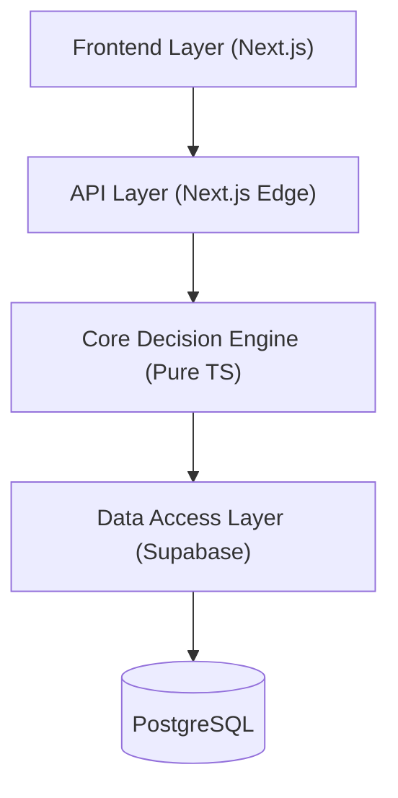
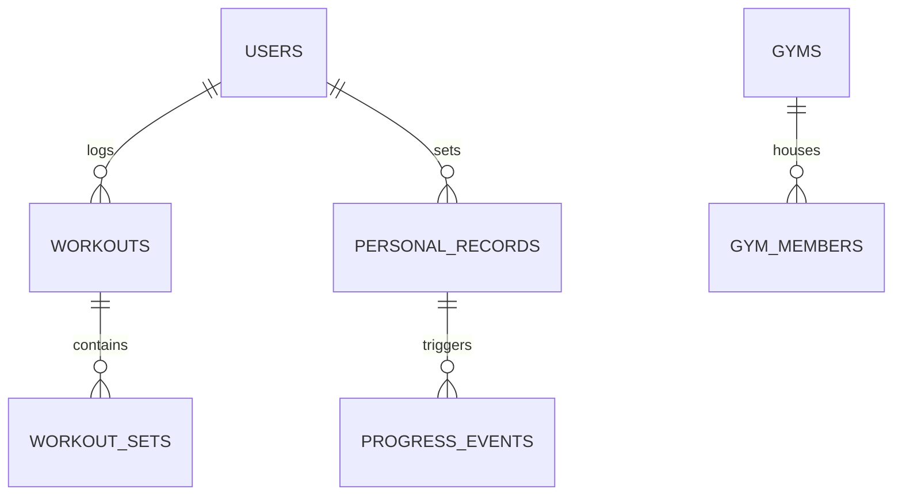

# HeliX V1 — Complete Project Documentation

Welcome to the official documentation for **HeliX**, a high-performance, mobile-first workout tracker built on a distributed monorepo architecture. 

HeliX moves beyond simple "log and forget" apps by introducing a **Core Decision Engine** that prioritizes improvement-based competition and prepares the ground for a future AI Gym Copilot.

---

## 📑 Index
- [1. System Architecture](#1-system-architecture)
- [2. Monorepo Structure](#2-monorepo-structure)
- [3. Core Decision Engine (@helix/engine)](#3-core-decision-engine-helixengine)
- [4. Data Layer (@helix/database)](#4-data-layer-helixdatabase)
- [5. API Reference](#5-api-reference)
- [6. Current Status (V1 Build)](#6-current-status-v1-build)
- [7. Future Vision: AI Gym Copilot](#7-future-vision-ai-gym-copilot)
- [8. Roadmap & Next Steps](#8-roadmap--next-steps)

---

## 1. System Architecture

HeliX is built with a **Strict 4-Layer Architecture**. This separation ensures that business logic is platform-agnostic, enabling us to support Web, iOS, and Android from the same "brain."

### Key Principles:
1.  **Frontend**: Pure UI. No direct DB calls. No business logic.
2.  **API**: Request validation and dependency injection.
3.  **Engine**: The "Brain." Pure TypeScript logic for PR detection, scoring, and gym rules.
4.  **DAL**: Maps engine interfaces to Supabase/PostgreSQL queries.

---

## 2. Monorepo Structure

We use **Turborepo** to manage our codebase. This allows for instant builds and shared logic across different apps.

- `apps/web`: The Next.js web application.
- `packages/engine`: The platform-agnostic business logic.
- `packages/database`: Supabase client and repository implementations.
- `packages/ui`: Shared Tailwind + Shadcn/ui configuration.

---

## 3. Core Decision Engine (@helix/engine)

The engine is the heart of HeliX. It is split into three specialized sub-engines:

### A. Workout Engine
Handles the flow of finishing a workout.
- **Set Validation**: Ensures weights and reps are realistic.
- **PR Detection**: Compares current performance with historical personal records.
- **Event Dispatching**: Post-workout, it triggers Progress and Activity events.

### B. Gym Engine
Manages the community and competitive aspects.
- **Membership**: Joining/leaving local gym ecosystems.
- **Leaderboards**: Improvement-based ranking logic.
- **Activity Feed**: Processes raw events into a readable gym stream.

### C. Progress Engine
Responsible for long-term analytics.
- **Improvement Scoring**: Calculates relative progress (%).
- **Strength Trends**: Queries historical data for specific exercises.

---

## 4. Data Layer (@helix/database)

HeliX uses **Supabase** (PostgreSQL) as its primary store. We use the **Repository Pattern** to decouple the engine from the database driver.

### Database Schema (Simplified)

- **Row Level Security (RLS)**: Every table is protected at the database level.
- **Real-time**: Activity feeds are powered by Supabase real-time subscriptions.

---

## 5. API Reference

All client interactions happen via `/api/*` routes.

| Endpoint | Method | Description |
|----------|--------|-------------|
| `/api/auth/*` | POST/GET | Supabase Auth management. |
| `/api/workouts/finish` | POST | Submits a completed workout to the Engine. |
| `/api/gym/leaderboard` | GET | Fetches the monthly improvement leaderboard. |
| `/api/gym/feed` | GET | Returns the latest activity events for a gym. |
| `/api/exercises` | GET | Lists the exercise library. |

---

## 6. Current Status (V1 Build)

**V1 Status: ✅ Completed Core Tracking**

- [x] Full Monorepo migration.
- [x] Supabase Auth integration.
- [x] Real-time Workout Logger (LocalStorage fallback included).
- [x] Automated PR Detection & Celebration.
- [x] Gym Leaderboard (Improvement-based).
- [x] Global Exercise Library (60+ movements).

---

## 7. Future Vision: AI Gym Copilot

The next evolution of HeliX is the **AI Gym Copilot**. This system will leverage the structured data collected in V1 to provide real-time coaching.

### The Copilot Interface

*Conceptual AI coaching dashboard with biometric heatmaps and predictive loading.*

### Community & Growth

*High-fidelity leaderboard showing community progress and athlete leveling.*

---

## 8. Roadmap & Next Steps

### 🟡 Phase 2: Advanced Analytics
- Muscular fatigue modeling.
- Volume balance analysis (Push/Pull/Legs ratios).
- PR history visualization with interactive charts.

### 🔵 Phase 3: AI Foundation
- AI-generated daily workout adjustments based on sleep/stress.
- Smart auto-fill for weights based on previous RPE.

### 🟣 Phase 4: Full Multi-Agent Coaching
- Adaptive training cycles (Periodization).
- Natural language voice coaching during sessions.

---
*Generated by Antigravity AI for the HeliX Project.*
