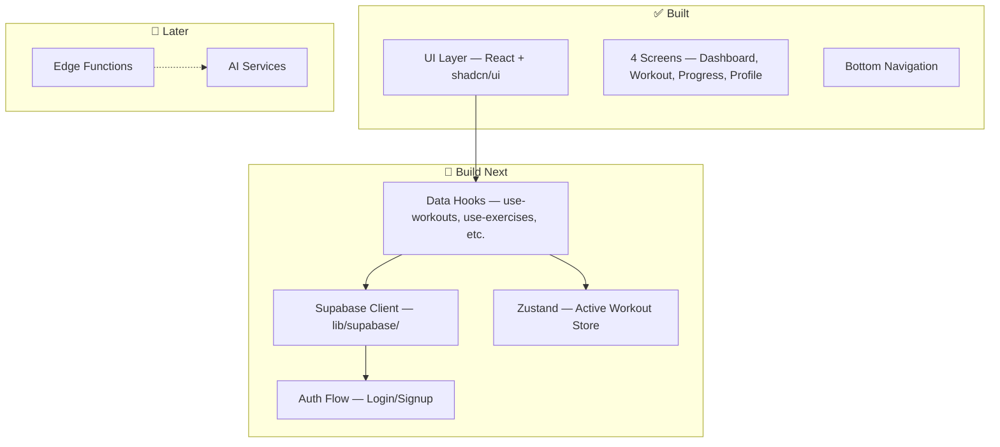

# HeliX — Project Task Tracker

> **Last Updated:** March 8, 2026  
> **Current Phase:** Phase 1 — Core Tracker  
> **Status:** Frontend scaffold complete, backend integration not started

---

## What's Done ✅

| Area | Status | Details |
|------|--------|---------|
| **Project scaffold** | ✅ | Next.js + TailwindCSS + shadcn/ui |
| **UI components library** | ✅ | 60+ shadcn/ui primitives in `components/ui/` |
| **Dashboard screen** | ✅ | Stats grid, streak, PRs, readiness (mock data) |
| **Workout Logger screen** | ✅ | Exercise cards, set logging, add exercise (localStorage) |
| **Progress screen** | ✅ | Charts, volume tracking (mock data) |
| **Profile screen** | ✅ | User info, goals, body weight (mock data) |
| **Bottom navigation** | ✅ | Mobile-first nav in `components/layout/` |
| **Dark theme support** | ✅ | `next-themes` + `theme-provider.tsx` |
| **System design doc** | ✅ | [system_design.md](file:///c:/Users/Rahul%20Talukdar/Documents/helix/helix-client/docs/system_design.md) |
| **AI architecture doc** | ✅ | [multi_agent_architecture.md](file:///c:/Users/Rahul%20Talukdar/Documents/helix/helix-client/docs/multi_agent_architecture.md) |

---

## What's Next — Priority Order

### 🔴 Phase 1: Core Tracker (YOU ARE HERE)

> **Goal:** Replace all mock/localStorage data with a real persistent backend.

#### 1. Supabase Setup
- [ ] Create a Supabase project
- [ ] Configure environment variables (`NEXT_PUBLIC_SUPABASE_URL`, `NEXT_PUBLIC_SUPABASE_ANON_KEY`)
- [ ] Create `lib/supabase/client.ts` — browser Supabase client
- [ ] Create `lib/supabase/server.ts` — server-side Supabase client

#### 2. Database Schema & Migrations
- [ ] Create `users` table (id, email, display_name, avatar_url, goal, experience_level)
- [ ] Create `exercises` table (id, name, muscle_group, category, is_custom, created_by)
- [ ] Create `workouts` table (id, user_id, title, duration_seconds, notes, started_at, completed_at)
- [ ] Create `workout_sets` table (id, workout_id, exercise_id, set_number, weight, reps, rpe, completed)
- [ ] Create `personal_records` table (id, user_id, exercise_id, weight, reps, record_type, achieved_at)
- [ ] Create `body_weight_logs` table (id, user_id, weight, logged_on)
- [ ] Create `user_exercise_settings` table (default weight/reps/sets per exercise per user)
- [ ] Seed the `exercises` table with a global exercise library
- [ ] Enable Row Level Security (RLS) on all tables

> [!TIP]
> Schema is fully designed in [system_design.md § 3](file:///c:/Users/Rahul%20Talukdar/Documents/helix/helix-client/docs/system_design.md). Follow it exactly.

#### 3. Authentication
- [ ] Build login page at `app/(auth)/login/page.tsx`
- [ ] Build signup page at `app/(auth)/signup/page.tsx`
- [ ] Create `lib/supabase/middleware.ts` for session refresh
- [ ] Create root `middleware.ts` for auth redirects
- [ ] Create `hooks/use-auth.ts` — auth state + sign-in/out methods
- [ ] Add auth guard to the app shell layout

#### 4. Data Hooks (Replace Mock Data)
- [ ] Create `hooks/use-workouts.ts` — fetch, create, update workouts via Supabase
- [ ] Create `hooks/use-exercises.ts` — fetch exercise library, search, create custom
- [ ] Create `hooks/use-progress.ts` — query strength progression, volume, PRs
- [ ] Create `hooks/use-profile.ts` — fetch/update user profile, body weight logs
- [ ] Generate TypeScript types from Supabase schema (`supabase gen types typescript`)

#### 5. Integrate Backend into Screens
- [ ] **Dashboard** — replace `localStorage.getItem('helix-stats')` in [dashboard.tsx](file:///c:/Users/Rahul%20Talukdar/Documents/helix/helix-client/components/dashboard/dashboard.tsx) with real queries
- [ ] **Workout Logger** — replace localStorage in [workout-logger.tsx](file:///c:/Users/Rahul%20Talukdar/Documents/helix/helix-client/components/workout/workout-logger.tsx) with Supabase writes
- [ ] **Progress** — replace mock chart data in [progress-tracker.tsx](file:///c:/Users/Rahul%20Talukdar/Documents/helix/helix-client/components/progress/progress-tracker.tsx) with real queries
- [ ] **Profile** — replace mock profile in [user-profile.tsx](file:///c:/Users/Rahul%20Talukdar/Documents/helix/helix-client/components/profile/user-profile.tsx) with Supabase

#### 6. Active Workout Session State
- [ ] Install Zustand (`pnpm add zustand`)
- [ ] Create `stores/workout-session.ts` — in-memory workout state with localStorage backup
- [ ] Implement mid-workout recovery (restore session on page reload)
- [ ] Wire the Zustand store into Workout Logger

#### 7. Deploy v1
- [ ] Deploy frontend to Vercel
- [ ] Configure Supabase production environment
- [ ] Test end-to-end auth + workout logging flow

---

### 🟡 Phase 2: Training Analytics

> **Goal:** Make progress data actually useful.

- [ ] Real strength progression charts (query `workout_sets` by exercise over time)
- [ ] Automatic PR detection — trigger `personal_records` insert on new max
- [ ] PR celebration UI (toast/animation when a PR is hit)
- [ ] Volume tracking per muscle group per week
- [ ] Workout frequency analytics (workouts/week trend)
- [ ] Workout history list view with detail drill-down

---

### 🔵 Phase 3: AI Foundation

> **Goal:** Introduce smart features powered by AI.

- [ ] Set up Supabase Edge Functions
- [ ] AI workout generation endpoint (`generate-workout`)
- [ ] Smart defaults — auto-fill weight/reps from last session
- [ ] Exercise recommendations based on training history

---

### 🟣 Phase 4: AI Gym Copilot

> **Goal:** Full AI coaching experience.

- [ ] Fatigue model + readiness scoring
- [ ] Multi-agent coaching engine (see [multi_agent_architecture.md](file:///c:/Users/Rahul%20Talukdar/Documents/helix/helix-client/docs/multi_agent_architecture.md))
- [ ] Adaptive training plans
- [ ] Natural language coaching interface

---

## 🎯 Immediate Next Steps

> [!IMPORTANT]
> **Start here.** These are the 3 things to do right now, in order:

| # | Task | Why |
|---|------|-----|
| **1** | Create a Supabase project + add env vars | Everything depends on this |
| **2** | Run the schema migrations (all 7 tables + RLS) | Data layer must exist before hooks |
| **3** | Build `lib/supabase/client.ts` and `hooks/use-auth.ts` | Auth is the gate to all user data |

Once these 3 are done, you can start replacing localStorage in each screen one at a time — **Dashboard → Workout Logger → Progress → Profile**.

---

## Architecture Reference

