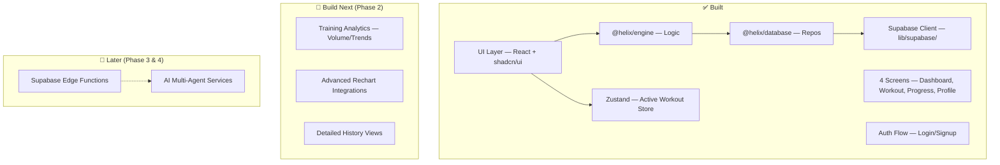

# HeliX — Project Task Tracker

> **Last Updated:** March 10, 2026  
> **Current Phase:** Phase 2 — Training Analytics  
> **Status:** V1 Core complete. Auth, Workout Logging, and PR Detection are live. Transitions to advanced analytics.

---

## What's Done ✅

| Area | Status | Details |
|------|--------|---------|
| **Project scaffold** | ✅ | Turborepo + Next.js + TailwindCSS + shadcn/ui |
| **UI components library** | ✅ | 60+ shadcn/ui primitives in `packages/ui` |
| **Engine Logic** | ✅ | PR Detection, Gym Improvement Scoring, Progress Analytics |
| **Database Layer** | ✅ | Supabase Repository Pattern with RLS |
| **Dashboard screen** | ✅ | Stats, streak, PRs linked to Supabase |
| **Workout Logger screen** | ✅ | Real-time logging with engine integration |
| **Progress screen** | ✅ | Strength charts and volume tracking |
| **Profile screen** | ✅ | User stats and goals from DB |
| **Authentication** | ✅ | Supabase Auth (Client & Server) |
| **Documentation** | ✅ | [v1_documentation.md](docs/v1_documentation.md) |
| **V1 Build** | ✅ | Stable V1 pushed to GitHub |

---

## What's Next — Priority Order

### 🔴 Phase 2: Training Analytics (YOU ARE HERE)

> **Goal:** Make progress data actually useful.

#### 1. Advanced Progress Visualization
- [ ] Real strength progression charts (query `workout_sets` by exercise over time)
- [ ] Volume tracking per muscle group per week (Heatmaps/Bar charts)
- [ ] Workout frequency analytics (workouts/week trend)

#### 2. UX & Feedback
- [ ] PR celebration UI (toast/animation when a PR is hit)
- [ ] Workout history list view with detail drill-down
- [ ] Smart defaults — auto-fill weight/reps from last session

---

### 🟡 Phase 3: AI Foundation

> **Goal:** Introduce smart features powered by AI.

- [ ] Set up Supabase Edge Functions
- [ ] AI workout generation endpoint (`generate-workout`)
- [ ] Exercise recommendations based on training history

---

### 🔵 Phase 4: AI Gym Copilot

> **Goal:** Full AI coaching experience.

- [ ] Fatigue model + readiness scoring
- [ ] Multi-agent coaching engine (see [multi_agent_architecture.md](docs/multi_agent_architecture.md))
- [ ] Adaptive training plans
- [ ] Natural language coaching interface

---

## 🎯 Immediate Next Steps

> [!IMPORTANT]
> **Start here.** Transitioning from "Logging" to "Analyzing":

| # | Task | Why |
|---|------|-----|
| **1** | Implement PR celebration UI | Immediate user feedback for motivation |
| **2** | Build workout history drill-down | Transparency into past performance |
| **3** | Muscular volume tracking | Core metric for balanced growth |

---

## Architecture Reference

